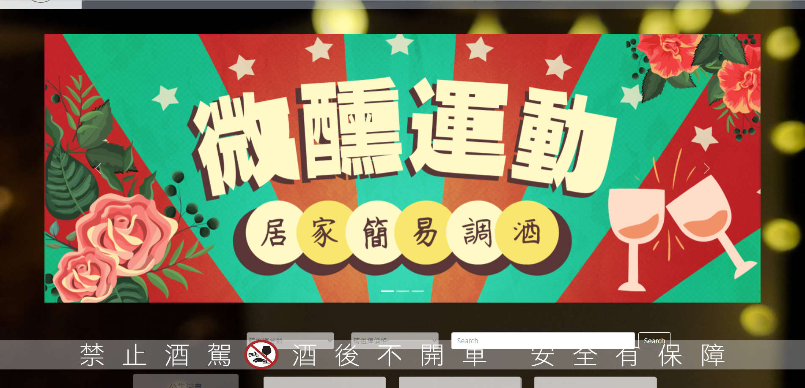

SQ (Spirit Quest)

此專案製作於 2024/1月份。

專題名稱：
。SpiritQuest 詢價網站

專題特色與使用技術：

。以JAVA Spring MVC架構撰寫，View層使用JSP技術撰寫，透過Controller接收請求參數後經由Servise向Model層取得需要的數據。

。使用HTML、CSS、Bootstrap、PureCss設計出美觀、直覺的介面。

。Model層與資料庫之溝通使用JDBC技術，更靈活的和資料庫溝通。

。用戶註冊與登入加入了OTP隨機驗證碼，避免大量註冊或者惡意的攻擊。

。使用Interceptor技術區分用戶是否登入，設計其能進入之頁面。

專題功能：

。名詞解釋

    使用者：意旨沒有登入，在session中無資料之系統使用者。
    會員：意旨有註冊且處於登入狀態之使用者。
    管理者：意旨有註冊與登入並且有權限進入後臺管理系統之使用者。
    
。會員系統

    會員註冊以及登入、會員姓名、電話修改功能。
    會員在沒有登入的情況下沒辦法進入購物車、查詢訂單、修改密碼、手機號碼等等的頁面。
    並且對會員和管理者做權限劃分，會員無法進入後台。
    註冊登入皆有隨機驗證碼的功能。
    
。商品展示系統

    使用者可以在前台看到商品。
    使用者可以點及顯示更多資訊來查看產品介紹。
    管理者可以在後台增加商品。
    管理者可以在商品列表刪除商品，並且會在確定刪除之前跳出提示框。
    
。詢價單系統

    會員在前台看到商品列表後加入購物車。
    會員可以透過送出訂單來詢問所選購的商品以及數量。

。留言信箱

    使用者可以透過「聯絡我們」頁面來留下他的問題。
    管理者在後台可以看到所有的聯絡單。
    
。布告欄

    管理者在後台可以新增布告欄。
    使用者可以在前台查看公告。
    

專題使用情境故事：

以下故事自會員角度而言：

    張三今天想舉辦一個聖誕派對，並且希望在他的派對上準備酒水讓客人得以盡興。但他不想去一般賣場通路選購，覺得那邊品項不多又只是基礎酒款不合胃口。
    這時張三想起家附近新開的酒類專門販賣店，上網查了一下發現他們還有架設詢價網站，可以查看目前上架之商品及價格，還能先下訂單之後再去拿。
    但他在商品列表區看來看去，做為一個門外漢實在是毫無頭緒，慶幸的是店家在「布告欄」發布了聖誕節酒單，但酒單的品項太少了，張三希望有更多風格類似的其他品項。
    於是他點擊「聯絡我們」，留下了他的問題和聯絡資訊並等待店家的回覆。

以下故事自管理者角度而言：

    李四今天開了一家酒類專門販賣店，並且因應數位化的潮流架設其店面之網站。他在該網站上面上架其商品，並且在後台新增公告之頁面增加最新的聖誕節酒單。
    在某個下午李四收到了張三的留言，透過電話李四成功的賣給張三一個他配好的派對酒單。

註解：
。本專題之一切圖片皆來自於網路，其中大部分素材來自於https://enjoyit999.com/，圖片僅供展示專案效果。

開啟方式：
1.將uploads資料夾存放至c槽子目錄，以便於在使用上傳資料功能時系統能夠抓取正確的資料夾。

